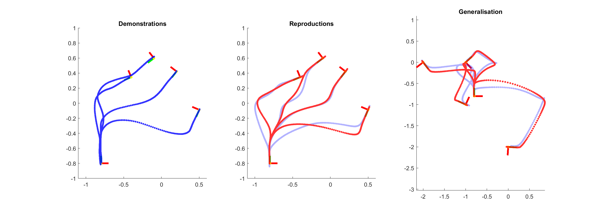

# alphaTPGMR
Example code to accompany: *A. Sena, B. Michael and M. Howard, "Improving Task-Parameterised Movement Learning Generalisation with Frame-Weighted Trajectory Generation," 2019 IEEE/RSJ International Conference on Intelligent Robots and Systems (IROS), Macau, China, 2019, pp. 4281-4287, doi: 10.1109/IROS40897.2019.8967688.*

```
@INPROCEEDINGS{8967688,
  author={A. {Sena} and B. {Michael} and M. {Howard}},
  booktitle={2019 IEEE/RSJ International Conference on Intelligent Robots and Systems (IROS)}, 
  title={Improving Task-Parameterised Movement Learning Generalisation with Frame-Weighted Trajectory Generation}, 
  year={2019},
  }
```

Published: https://ieeexplore.ieee.org/document/8967688

Preprint: https://arxiv.org/abs/1903.01240

Demo of alphaTPGMR method, compared against the original TP-GMR model. Given a set of demonstrations, a reproduction of the original demos is generated using alphaTPGMR and then TPGMR. Trajectories are then generated with both methods for a set of randomly generated task parameters to test generalisation capabilities.


It can be seen that this method provides significantly improved generalisation performance, compared against the original TPGMR method.
